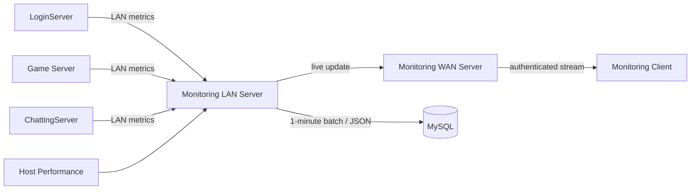

# MonitoringServer

> 로그인·게임·채팅 서버의 운영 지표를 수집해 모니터링 도구와 MySQL로 전달하는 이중 endpoint 서버

`C++20` · `Windows` · `IOCP` · `LAN / WAN` · `MySQL` · `JsonCpp`

## 프로젝트 한눈에 보기

| 항목 | 내용 |
|---|---|
| 내부 endpoint | Login/Game/Chat 서버의 등록과 지표 update 수신 |
| 외부 endpoint | 인증된 Monitoring Client에 실시간 지표 전파 |
| 자체 관측 | CPU, non-paged memory, available memory, network send/recv |
| 집계 주기 | 수신·자체 지표는 초 단위 처리, DB 기록은 1분 단위 |
| 영속화 | MySQL stored procedure에 지표 배열을 JSON으로 전달 |

## 데이터 흐름

수집용 LAN endpoint와 조회용 WAN endpoint를 분리해, 게임 서버의 운영 트래픽과 외부 도구 연결을 서로 다른 세션 집합으로 관리합니다.

## 핵심 구현

### 1. 서버 지표 수집

- 내부 서버가 server type으로 로그인한 뒤 `dataType`, `dataValue`, `timestamp`를 전송합니다.
- Login·Game·Chat 서버별 CPU, memory, session, packet/update 지표 enum을 구분합니다.
- 수집 packet은 [`MonitorProtocol.h`](MoniteringServer/MoniteringServer/MonitorProtocol.h)에 정의되어 있습니다.

### 2. 외부 모니터링 stream

- WAN client는 별도 session key로 로그인합니다.
- 인증된 session 집합에 최신 지표 packet을 broadcast합니다.
- 관련 구현: [`MonitoringWanServer.cpp`](MoniteringServer/MoniteringServer/MonitoringWanServer.cpp)

### 3. 자체 시스템 지표

- Windows performance API로 CPU, memory와 network 누적값을 갱신합니다.
- monitoring host의 지표도 다른 서버 데이터와 같은 packet 흐름으로 외부 client에 보냅니다.
- 관련 구현: [`PerformanceMonitor.cpp`](MoniteringServer/MoniteringServer/PerformanceMonitor.cpp)

### 4. 1분 단위 DB 기록

- 수신 지표를 server/type 기준으로 메모리에 모읍니다.
- DB worker가 1분마다 snapshot을 만들고 `InsertMonitoringData` stored procedure를 호출합니다.
- type/value 배열은 JsonCpp로 직렬화해 한 번의 procedure 입력으로 전달합니다.
- 관련 구현: [`DBConnection.cpp`](MoniteringServer/MoniteringServer/DBConnection.cpp)

## 수집 범주

| 대상 | 대표 지표 |
|---|---|
| LoginServer | 실행 상태, CPU, memory, session, auth 처리, packet pool |
| GameServer | session, player 상태, packet send/recv, DB queue, content FPS |
| ChattingServer | session, player, update, packet/update pool |
| Monitoring host | CPU, non-paged memory, available memory, network traffic |

## 코드 탐색

| 경로 | 설명 |
|---|---|
| [`MoniteringServer.sln`](MoniteringServer/MoniteringServer.sln) | Visual Studio solution — 원본 디렉터리 철자 유지 |
| [`MonitoringLanServer.cpp`](MoniteringServer/MoniteringServer/MonitoringLanServer.cpp) | 수집, forwarding, DB snapshot orchestration |
| [`MonitoringWanServer.cpp`](MoniteringServer/MoniteringServer/MonitoringWanServer.cpp) | 외부 client 인증과 broadcast |
| [`MonitoringDefine.h`](MoniteringServer/MoniteringServer/MonitoringDefine.h) | 서버별 metric mapping |
| [`jsoncpp-master`](MoniteringServer/MoniteringServer/jsoncpp-master) | JSON 직렬화 의존성 source |

## 빌드 및 실행 전제

- Visual Studio 2022 toolset `v143`, Windows 10 SDK, C++20
- WinSock2, MySQL client library, JsonCpp
- [`MonitoringCnf.txt`](MoniteringServer/MoniteringServer/MonitoringCnf.txt)의 LAN/WAN·DB·client 인증 설정을 로컬 값으로 교체
- MySQL에 호환 schema와 `InsertMonitoringData` procedure를 준비한 뒤 서버 실행

> tracked 설정과 바이너리 의존성은 과거 로컬 환경 기준입니다. 자격 증명 형태의 값은 그대로 사용하지 말고 별도 환경 값으로 교체해야 하며, 깨끗한 머신의 재현 빌드는 아직 검증하지 않았습니다.

## 현재 상태

이 저장소는 운영 관측 파이프라인을 직접 구성한 2024년 레거시 포트폴리오입니다. 시작·종료 순서와 WAN session 수명뿐 아니라 입력 기반 배열 index, 정의되지 않은 packet의 원격 crash 경로, 고정 크기 buffer 경계, DB batch 실패 처리를 후속 현대화에서 우선 검증할 영역으로 관리합니다.

연계 저장소: [LoginServer](https://github.com/ldcity/LoginServer) · [ChattingServer](https://github.com/ldcity/ChattingServer)
